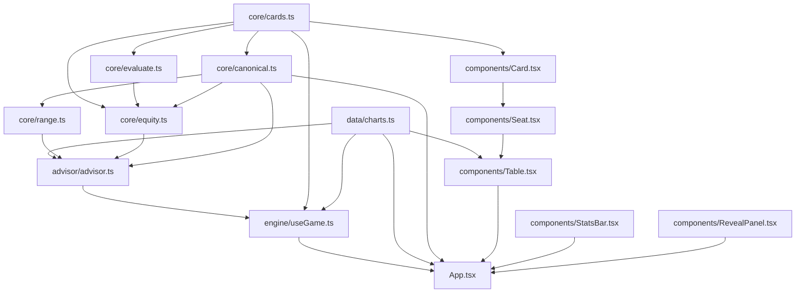

# Architecture

"Fold or Play" is a single-page Vite + React 19 app: a preflop fold/play trainer. The
[React Compiler](https://react.dev/learn/react-compiler) is enabled (`vite.config.ts`), so components
are auto-memoized — don't hand-add `useMemo`/`useCallback` defensively. Styling is Tailwind v4
(`@tailwindcss/vite`) with theme tokens in `src/index.css`. There is no external state library; all
state lives in one `useReducer`.

## Module dependency graph



Edges point from the imported module to its importer (provider → consumer), so the diagram doubles as
an import map.

**Layering rule:**

- `core/` — pure domain logic (cards, canonical hand indexing, range parsing, hand evaluation, equity
  simulation). No React import anywhere in this directory.
- `advisor/` — a scoring layer that composes `core/` + `data/charts.ts` into hand verdicts. No React
  import either.
- `engine/useGame.ts` — the only stateful layer. A `useReducer` wrapping `advisor/`.
- `components/` — presentational only; render props and call the callbacks `useGame` returns.

## State model

`useGame` (`src/engine/useGame.ts`) is a `useReducer` with three actions:

- `ACT` — the player folds or plays; scores the action via `advisor.scoreAction` and updates stats.
- `NEXT` — deals a new hand.
- `SET_TABLE_SIZE` — switches table size (2/6/9-max) and resets the session.

It produces two pieces of state:

- **`HandState`** — `cards` (the two hole cards dealt), `situation` (table size + seat), `phase`
  (`"AWAITING_ACTION"` | `"REVEALED"`), `action` (the player's choice, once made), `verdict` (the
  graded result, once revealed).
- **`SessionStats`** — `hands`, `correct`, `defensible`, `leaks`, `evLostBb`, `streak`, `bestStreak`.
  See [DOMAIN.md](./DOMAIN.md) for what `correct` / `defensible` / `leak` actually mean.

`App.tsx` owns keyboard shortcuts (`f` = fold, `space`/`p` = play, `space`/`n` = next hand) and wires
the reducer's output to `Table`, `StatsBar`, and `RevealPanel`.

## Component tree

```
App
├── StatsBar        (session accuracy, streak, EV lost, leaks)
├── Table            (the felt, seat layout)
│   └── Seat × N     (one per table position)
│       └── PlayingCard × 2   (hero's hole cards, or a face-down back)
└── RevealPanel       (shown once a hand is graded)
```

`Table` computes each seat's screen position from `seatIndex` (the hero's position) and renders one
`Seat` per entry in that table size's `CHARTS` array (see [DOMAIN.md](./DOMAIN.md)). `RevealPanel`
renders only after `useGame` produces a `verdict`.

## See also

- [DOMAIN.md](./DOMAIN.md) — the poker domain model (range charts, equity simulation, EV heuristic).
- [SETUP.md](./SETUP.md) — dev environment, scripts, and conventions.
