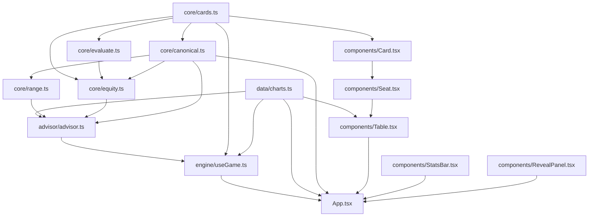

# Agent Harness and Developer Documentation - Plan

## Goal Capsule

- **Objective:** Any coding agent or new developer can get correct, load-bearing context about this poker trainer — architecture, domain logic, and dev workflow — without first reading all nine source files.
- **Means:** A compact `AGENTS.md` harness at the repo root plus three focused reference docs under `docs/` (KTD1, KTD2).
- **Authority hierarchy:** This plan is authoritative on scope. The existing source code is authoritative on domain facts — the docs describe the code, never the other way around.
- **Execution profile:** Single-pass, documentation-only. No source files change.
- **Stop conditions:** Do not modify `src/**`, `README.md`, or any config file. Do not add tests or CI.
- **Tail ownership:** Documentation-only work; no PR/ship strategy beyond this plan's Verification Contract.

## Product Contract

### Summary

Add an `AGENTS.md` agent-context harness at the repo root and three developer-onboarding docs under `docs/` (`ARCHITECTURE.md`, `DOMAIN.md`, `SETUP.md`) for this preflop fold/play poker trainer. Documentation only — no source changes.

### Problem Frame

The repo was scaffolded and its poker logic implemented in a single session, so it currently carries no orientation material at all: `README.md` is untouched Vite template boilerplate with zero mention of poker, there is no `AGENTS.md`/`CLAUDE.md`, and no `docs/` directory. The domain logic that exists — canonical hand-class indexing, a hand-authored range-notation grammar, an in-browser Monte Carlo equity simulator, and an EV heuristic — is non-obvious and math-heavy, and two source files (`src/advisor/advisor.ts`, `src/data/charts.ts`) cite a "system design doc §03/04/11" that does not exist anywhere in this repo. Both a future coding agent and a future developer would have to reconstruct all of this from source before making a safe change.

### Requirements

- R1. `AGENTS.md` exists at the repo root and gives any coding agent (not Claude Code-specific) instant orientation: project purpose, tech stack and commands, a module map, domain vocabulary pointers, and conventions/gotchas — scannable in a couple of minutes, not a copy of the deep docs.
- R2. `docs/ARCHITECTURE.md` documents the module structure and data flow: the `core/` → `advisor/` → `engine/` → `components/` layering, the reducer-driven state model in `useGame`, and the component tree.
- R3. `docs/DOMAIN.md` documents the poker domain model powering the app — canonical 169-class hand indexing, the range-notation grammar, the RFI-chart methodology, the Monte Carlo equity engine, and the EV-heuristic formula with its constants — reconstructed from source and code comments, since no separate design doc exists in the repo (KD3).
- R4. `docs/SETUP.md` documents the dev environment, npm scripts, tooling, observed coding conventions, and the current absence of a test suite, so a new contributor can get productive immediately.

### Key Decisions

- **KD1. Harness file is `AGENTS.md`, not `CLAUDE.md`.** (session-settled: user-directed — chosen over `CLAUDE.md`: the user wants other kinds of coding agents, not only Claude Code, to pick up the harness.) Governs R1.
- **KD2. `README.md` stays as-is; new docs live separately under `docs/`.** (session-settled: user-approved — chosen over rewriting `README.md` into a real project overview: keeps this plan additive-only.) Governs Scope Boundaries.
- **KD3. `docs/DOMAIN.md` reconstructs the EV/range logic from source only; it does not attempt to locate or recreate the referenced-but-absent "system design doc §03/04/11."** (session-settled: user-approved — chosen over pausing to search for that document: it is not in this repo and no external copy was named.) Governs R3.

### Success Criteria

- A developer or agent new to the repo can, using only `AGENTS.md` plus the `docs/` files (no source reading required first), explain the RFI-chart/EV-heuristic approach at a high level and identify the right file to touch for a plausible change (e.g., "add a 4-max table size" or "tune the EV realization constants").

### Scope Boundaries

- In scope: `AGENTS.md`, `docs/ARCHITECTURE.md`, `docs/DOMAIN.md`, `docs/SETUP.md`.
- Out of scope: rewriting `README.md` (KD2); locating or recreating the "system design doc §03/04/11" referenced in code comments (KD3); writing an actual test suite (`docs/SETUP.md` names this gap, per R4, but does not fill it); a `CONTRIBUTING.md` or PR template.

## Planning Contract

### Key Technical Decisions

- KTD1. Split developer docs into three focused files (`ARCHITECTURE.md`, `DOMAIN.md`, `SETUP.md`) under `docs/`, rather than one combined guide — each stays independently scannable, and `AGENTS.md` can link precisely into the section a task needs.
- KTD2. `AGENTS.md` stays a compact index that links into `docs/` for depth rather than inlining the domain math — keeps the "instant context" file short while the deep material lives where it can grow.
- KTD3. `docs/DOMAIN.md` documents the EV heuristic and RFI charts as explicitly non-solver-grade, mirroring the source's own comments (`advisor.ts`'s "Never surfaced in the UI as 'GTO' or 'solver'", `charts.ts`'s "not solver output") — prevents the docs from overstating rigor the implementation doesn't have. Governs R3.

### High-Level Technical Design

`docs/ARCHITECTURE.md` (U1) needs a module-dependency diagram — the layering below has 7 components with directed relationships prose alone would leave ambiguous:



`core/` has no React dependency; `advisor/` is a pure scoring layer over `core/` + `data/`; `engine/useGame.ts` is the only stateful layer (a `useReducer`); `components/` are presentational.

### Output Structure

```text
AGENTS.md              (new — repo root)
docs/
  ARCHITECTURE.md       (new)
  DOMAIN.md              (new)
  SETUP.md               (new)
```

## Implementation Units

### U1. `docs/ARCHITECTURE.md` — module map and data flow

**Goal:** Give a reader the module layering and state-management model before they touch any file.

**Requirements:** R2

**Dependencies:** none

**Files:**
- `docs/ARCHITECTURE.md` (create)

**Approach:**
- Open with a one-paragraph shape: single-page Vite + React 19 app, React Compiler enabled, Tailwind v4 for styling, no external state library.
- Include the module-dependency diagram from Planning Contract's High-Level Technical Design.
- Document the state model: `useGame` (`src/engine/useGame.ts`) is a `useReducer` with three actions (`ACT`, `NEXT`, `SET_TABLE_SIZE`) producing `HandState` (`cards`, `situation`, `phase`, `action`, `verdict`) and `SessionStats` (accuracy, streak, EV lost); `App.tsx` owns keyboard shortcuts and wires the reducer's output to `Table`, `StatsBar`, and `RevealPanel`.
- Document the component tree: `App` → `Table` → `Seat` → `PlayingCard` (`Card.tsx`), plus `App` → `StatsBar` and `App` → `RevealPanel`.
- Name the layering rule explicitly: `core/` is pure domain logic with no React import; `advisor/` composes `core/` + `data/charts.ts` into a scoring layer; `engine/` is the only stateful layer; `components/` are presentational only.

**Patterns to follow:** Existing module boundaries as-is (this unit documents them; it does not change them).

**Test expectation:** none — documentation content, not executable behavior.

**Verification:** Every file path and module name cited resolves in the current repo (`ls` / `rg` check); the diagram's edges match each file's actual imports.

---

### U2. `docs/DOMAIN.md` — poker domain model

**Goal:** Document the domain math so a reader never has to reverse-engineer it from source again.

**Requirements:** R3

**Dependencies:** none

**Files:**
- `docs/DOMAIN.md` (create)

**Approach:**
1. **Canonical hand classes** (`src/core/canonical.ts`) — the 169-class 13x13 layout (row/col = rank index 0..12, `row<col` suited, `row>col` offsuit, `row===col` pair), why suits collapse (suit-isomorphism), and `classIndex`/`classLabel`.
2. **Range notation grammar** (`src/core/range.ts`) — the token grammar (`22+`, `A2s+`, `ATo+`, `98s`, `44:0.5`), how `+` and `:freq` parse, and the `Float32Array(169)` frequency output.
3. **RFI charts** (`src/data/charts.ts`) — v1 scope is unopened-pot raise-first-in only, one hand-authored range per seat keyed by table size (2/6/9), chosen for internal consistency (range width widens toward the button, small blind as the one documented exception) rather than solver precision — reconstructed from the file's own comments (KD3, KTD3), flagged as not sourced from the missing "system design doc §03/§11."
4. **Monte Carlo equity engine** (`src/core/equity.ts`) — `simulateEquityVsRandom`'s partial Fisher-Yates shuffle + full-board runouts against `evaluateBest7`; `equityVsRandom`'s memoization by canonical class + opponent count (valid because equity vs. random is suit-isomorphic); the default 600-trial count.
5. **Hand evaluator** (`src/core/evaluate.ts`) — the `category*15^5 + kickers` scoring encoding and `evaluateBest7`'s best-of-21 combination search.
6. **EV heuristic** (`src/advisor/advisor.ts`) — the four named constants (`OPEN_SIZE_BB`, `CONTINUE_FREQ_PER_OPPONENT`, `REALIZATION_IN_POSITION`, `REALIZATION_OUT_OF_POSITION`), the `evPlayBb` formula, and the three-way verdict grading actually returned by `scoreAction`: `fPlay` strictly between 0.15 and 0.85 is always "defensible"; outside that band, the verdict is "correct" when the player's action matches the chart recommendation (`PLAY` when `fPlay >= 0.85`, `FOLD` when `fPlay <= 0.15`) and "leak" otherwise. Name all three `VerdictKind` values — "leak" also drives `SessionStats.leaks`, the RevealPanel "Leak" chip, and the streak reset in `useGame`'s reducer. State explicitly, mirroring the source comment, that this is "an explicit, documented heuristic, not solver output" and must never be presented in the UI as GTO/solver-grade (KTD3).

**Patterns to follow:** Cite the exact source file and constant/function name for every claim so the doc stays checkable against the code.

**Test expectation:** none — documentation content, not executable behavior.

**Verification:** Every named constant, function, and formula cited exists verbatim in the named source file (spot-check with `rg`); the doc states plainly, near the top, that the source system-design document it references does not exist in this repo. Additionally, trace one worked example (a specific hand, seat, and opponent count) through the `evPlayBb` formula by hand and confirm the doc's stated output matches what the code actually computes — identifier-existence checks alone don't catch an interpretive error in the reconstructed math.

---

### U3. `docs/SETUP.md` — dev environment and workflow

**Goal:** Get a new contributor from clone to running app, and make the current testing gap visible rather than silently absent.

**Requirements:** R4

**Dependencies:** none

**Files:**
- `docs/SETUP.md` (create)

**Approach:**
- Prerequisites and install (`npm install`).
- Scripts from `package.json`: `npm run dev` (Vite dev server, port 3000 per `vite.config.ts`), `npm run build` (`tsc -b && vite build`), `npm run lint`, `npm run preview`.
- Tooling notes: Vite 8 with `@vitejs/plugin-react` and `@rolldown/plugin-babel` (React Compiler), Tailwind v4 via `@tailwindcss/vite`, TypeScript project references split across `tsconfig.app.json`/`tsconfig.node.json`.
- Mention `.claude/launch.json`'s `poker-dev` configuration as an existing agent/IDE launch entry point for the dev server.
- Observed conventions: functional components only, reducer-based state (no external state library), Tailwind utility classes plus CSS custom-property theme tokens in `src/index.css`, relative imports (no path aliases configured).
- Explicit gap: no test files exist anywhere in the repo and `package.json` has no test script. State this as a known gap, not a silent omission, without adding a suite in this plan (Scope Boundaries).

**Patterns to follow:** n/a — greenfield doc.

**Test expectation:** none — documentation content, not executable behavior.

**Verification:** Every command listed exists in `package.json`'s `scripts`; running `npm run dev`, `npm run build`, and `npm run lint` as documented succeeds against the current repo state.

---

### U4. `AGENTS.md` — agent context harness

**Goal:** Give any coding agent a single, fast-loading orientation file.

**Requirements:** R1

**Dependencies:** U1, U2, U3 (links into their content, so drafted last for accurate cross-links)

**Files:**
- `AGENTS.md` (create, repo root)

**Approach:**
- Sections: one-line project purpose ("Fold or Play" preflop trainer); tech stack and commands (link to `docs/SETUP.md` for detail); module map (link to `docs/ARCHITECTURE.md`); domain vocabulary quick-reference — name the key terms (canonical hand class, range notation, RFI chart, EV heuristic) and link to `docs/DOMAIN.md` for the full explanation; conventions and gotchas.
- Gotchas to include: React Compiler auto-memoizes — don't hand-add `useMemo`/`useCallback` defensively; the EV heuristic is explicitly not solver-grade and must never be described as GTO/solver in code, comments, or UI copy (KTD3); no test suite exists yet.
- Keep it index-shaped (KTD2) — link into the three `docs/` files rather than repeating their content.

**Patterns to follow:** n/a — greenfield doc.

**Test expectation:** none — documentation content, not executable behavior.

**Verification:** Every relative link to `docs/ARCHITECTURE.md`, `docs/DOMAIN.md`, and `docs/SETUP.md` resolves; the file stays scannable in a couple of minutes (no inlined domain math).

## Verification Contract

- `npm run build` — passes identically to the pre-change baseline (confirms no `src/**` file was accidentally touched).
- `npm run lint` — passes identically to the pre-change baseline.
- Content check: every source file path, exported symbol, and named constant cited across `AGENTS.md` and the three `docs/` files resolves in the current repo (`rg` spot-check per unit's Verification field above).
- Comprehension check: using only `AGENTS.md` plus the three `docs/` files (no other source reading), answer cold which file sets the RFI range for a 4-max table and what `REALIZATION_OUT_OF_POSITION` does — confirms the Success Criteria's stated outcome, not just that the docs are internally accurate.

## Definition of Done

- `AGENTS.md`, `docs/ARCHITECTURE.md`, `docs/DOMAIN.md`, and `docs/SETUP.md` all exist with the content described in their units.
- `git status` shows only additions under `AGENTS.md` and `docs/**` — no other file was modified.
- All cross-links between `AGENTS.md` and the three `docs/` files resolve.
- `docs/DOMAIN.md` states plainly that the "system design doc §03/04/11" cited in source comments does not exist in this repo (KD3).
- `docs/SETUP.md` states plainly that no test suite exists yet (R4).
- No stray scratch or draft files remain outside `AGENTS.md` and `docs/**`.
